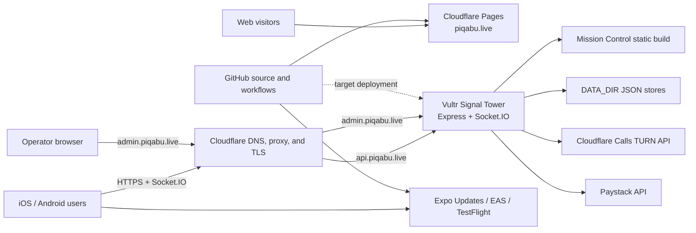

# Architecture

## System view

Cloudflare is the public edge; Vultr is the application origin. Public clients use stable project-owned domains so the origin can move without another client release.

## Production addresses

| Address | Role | Origin or platform |
| --- | --- | --- |
| `https://piqabu.live` | Landing site, downloads, legal pages, universal-link callbacks | Cloudflare Pages |
| `https://api.piqabu.live` | Signal Tower REST and Socket.IO endpoint | Cloudflare proxy to Vultr |
| `https://admin.piqabu.live` | Mission Control operator console | Cloudflare proxy to the backend’s `/mission/` build |
| `https://u.expo.dev/eb9a4e25-cfdd-4c53-b25c-d5e52973595c` | Expo OTA update service | Expo |

Use the root `https://admin.piqabu.live/` URL for Mission Control. Friendly deep links such as `/login` are not guaranteed to survive a direct refresh because the origin’s SPA fallback is scoped to `/mission/*`.

## Components

### Expo client

The client lives in `client/` and uses Expo Router, React Native, Socket.IO, and WebRTC. Production API traffic is configured in `client/constants/Config.ts` for `https://api.piqabu.live`.

The Android keyboard remains a native Kotlin IME under `client/android/`. The iOS keyboard is an independent, offline Swift extension under `client/targets/keyboard/`, generated into the Xcode project by `@bacons/apple-targets`. Its bundle identifier is `com.krasumashi.piqabu.keyboard`; it requests no Full Access, network, pasteboard, or shared-container capability. It locally inserts a universal link, after which sender and receiver enter the containing app by tapping the link.

Native identity and update constraints:

- Apple Team ID: `VL5QP7VU37`.
- iOS bundle ID and Android package: `com.krasumashi.piqabu`.
- custom scheme: `piqabu`.
- associated domain: `applinks:piqabu.live`.
- Expo project ID: `eb9a4e25-cfdd-4c53-b25c-d5e52973595c`.
- current native version: `1.0.2`.
- current Expo runtime version: `1.0.0`.
- EAS branches/channels: `preview` and `production`.

An OTA may update compatible JavaScript and bundled assets. It cannot safely add or change native modules, permissions, entitlements, identifiers, schemes, icons, or runtime compatibility.

Live Glass camera video uses a named native WebRTC frame processor, `piqabu-monochrome`, before encoding. The processor preserves the luminance plane and neutralizes chroma, so the local preview and transmitted stream are genuinely monochrome rather than display-filtered. Android processes I420 frames; iOS processes the camera's bi-planar or BGRA pixel buffers. The JavaScript activation is deliberately fail-open: a missing or failed processor leaves the original colour track in place so a call is not sacrificed for the effect. The processor is injected into the pinned `react-native-webrtc` 124.0.7 native source by the client's post-install script and therefore requires a new native binary; it is not introduced by an Expo OTA.

The iOS keyboard is therefore present only in native binaries built after the extension was added. TestFlight build 5 does not contain it; signed build `1.0.2 (9)` does.

Peek privacy is platform-specific. Android uses the operating system's secure-window protection while revealed media is visible. On iOS, the active screenshot-blocking implementation in `expo-screen-capture` is not used for Peek because its secure-layer technique blanked image, video, PDF, and React Native content on the tested runtime. iOS retains visible watermarks and uses an app-switcher privacy overlay when the app loses focus. Active iOS screenshots are therefore a known platform limitation pending a media-safe native alternative.

### Signal Tower backend

The backend lives in `server/` and provides:

- health and runtime status;
- room creation, minted join codes, presence, and signaling over Socket.IO;
- short-lived file uploads;
- ICE server discovery and Cloudflare TURN credential retrieval;
- Paystack donation initialization, verification, callbacks, and webhooks;
- optional Apple IAP and legacy Stripe paths;
- admin endpoints protected by `ADMIN_API_KEY`;
- the compiled Mission Control application under `/mission`.

Room membership, presence, minted-code state, and active Socket.IO connections are memory-resident. A backend restart ends that ephemeral state by design. An unused minted code expires after 30 minutes.

### Mission Control

The operator UI lives in `mission-control/`. Its production build is served by the Signal Tower. It sends the entered admin key in the `x-admin-key` header and keeps the value in browser `sessionStorage`, so closing the tab ends the local session. The authenticated shell, navigation, forms, data tables, detail panes, and levers are responsive for phone operation; wide operational tables scroll within their own panels instead of forcing the whole page sideways.

### Landing and distribution

The static site lives in `landing-site/`. Important public integrations include:

- Formspree form endpoint `https://formspree.io/f/mgorlgve`;
- Android stable download `https://github.com/krasumashi/piqabu/releases/latest/download/piqabu.apk`;
- public TestFlight beta `https://testflight.apple.com/join/ZQjMEVCC`;
- SideStore source `https://piqabu.live/apps.json`;
- SideStore IPA release at the fixed GitHub `ios-latest` release;
- Apple association and Android asset-link files for project-owned domains.

TestFlight is the primary iOS beta path. SideStore is a visibly secondary alternative and does not replace App Store Connect.

## Runtime flows

### Ephemeral room and media flow

1. A client reaches `api.piqabu.live` and creates or joins a room.
2. Socket.IO maintains room presence and WebRTC signaling.
3. The client requests `/ice-servers`; the backend obtains short-lived TURN credentials from Cloudflare when configured and caches them for about one hour.
4. The client attempts WebRTC with returned ICE servers. Google STUN remains a fallback, but STUN alone does not guarantee difficult NAT traversal.
5. Uploads are staged under `UPLOAD_DIR` (default `/tmp/uploads`), limited to 15 MB, tracked with the room, and removed during room cleanup. Signal Stream v2 clients also request immediate deletion when the sender Covers an object.

Cloudflare R2 is activated in the account but is not integrated into the current upload flow.

### Donation flow

1. The client calls the backend donation-initialization route.
2. The backend uses the server-side Paystack secret and a strict callback URL.
3. Android returns through `https://piqabu.live/upgrade`; iOS returns through `piqabu://upgrade` so the app can resume correctly.
4. The client or webhook path verifies payment status with the backend.

Only the public Paystack key belongs in client-visible configuration. The live secret must remain server-side.

### Update and release flow

JavaScript-only changes can be published to the `preview` branch first and then `production` through `.github/workflows/expo-ota.yml`. Native changes require an EAS build and the platform’s distribution path. Build dates in App Store Connect do not change when an OTA is published.

## Persistence and recovery boundary

The backend persists early-stage operational data as JSON files inside the configured `DATA_DIR`:

- `subscriptions.json`;
- `donations.json`;
- `devices.json`;
- `admin.json`.

These files are the state that must be backed up and restored during a server migration. The checked-in systemd target expects `/var/lib/piqabu`; the live Alpine/OpenRC instance uses the value set in its root-only environment file and must be inspected without printing its secrets.

There is no database replication or automated R2 backup in this repository. A successful application deploy is not evidence of a successful state backup.

## Trust and security boundaries

- Cloudflare terminates public TLS and proxies the Vultr origin.
- Vultr holds backend secrets and persistent JSON state.
- GitHub Actions and Expo hold deployment credentials; they should never expose runtime secrets in logs.
- Mission Control’s shared admin key grants operational access and should be rotated like a password.
- The server currently configures permissive CORS for HTTP and Socket.IO even though an `ALLOWED_ORIGINS` variable exists. Strict origin enforcement is known security debt, not a current guarantee.
- Historical Render and Netlify files or labels are legacy references. They do not define current production architecture.

## Related decisions

See [Decisions](DECISIONS.md) for the provider-neutral endpoint, deployment split, update-channel policy, data-store choice, and phone-first operating model.
